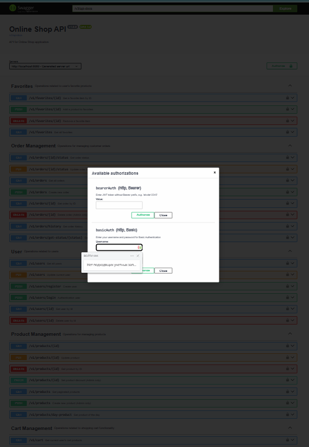

# Garden Shop 

---
## links :

- [technical task](https://drive.google.com/file/d/1EeizwvyhIcv_X-ib8Tbmlx2SOyma-aw5/view)

- [layout](https://www.figma.com/design/SDNWLzCWkh9ZXdCpWEaByv/project-frontend?node-id=0-1&p=f)

- [rest api](https://confirmed-baron-2e5.notion.site/REST-API-f186cf63a46c4020b2237f73093922ab)

- [deploy](https://#)
---
## General description

#### GardenShop is a modern web-based e-commerce application developed as a graduation project. It allows users to browse products, manage their shopping cart, place orders, leave reviews, and mark items as favorites. The platform is tailored for parents and children, with a special focus on usability, performance, and clean architecture. It is built with Java and Spring Boot, featuring RESTful APIs, DTO-layer separation, MySQL integration, and comprehensive exception handling.

***Key features include:***

- Full CRUD operations for users, products, categories, orders, carts, reviews, and favorites

- Token-based user authentication and role management

- Clean architecture with separate layers (controller, service, repository, DTO, mapper)

- Swagger UI for API documentation and testing

- Modular and scalable structure prepared for future extensions (e.g., subscriptions, content section)

---

## Screenshot of the project's main page

---

## Main functionality of the project
- [x] User registration 
- [x] User authentication
- [x] Editing a user profile
- [x] Deleting an account
- [x] Adding a new product
- [x] Editing a product
- [x] Deleting a product
- [x] Adding a new product category
- [x] Editing a product category
- [x] Deleting a product category
- [x] Getting a list of products
- [x] Getting detailed information about a product
- [x] Getting a list of product categories
- [x] Adding a product to the cart
- [x] Placing an order
- [x] Viewing the order status
- [x] User purchase history
- [x] Getting a list of the user's favorite products

---

## Stack of Technology

- Programming language: Java 11 or higher.
- Core framework: Spring Boot 2.x.
- Security: Spring Security.
- Data processing and mapping: Spring Data JPA/Hibernate.
- Core DBMS: PostgreSQL.
- Database connectivity: Used Spring Data to integrate with the
database to provide simplified data handling and support for a database migration mechanism via Flyway or Liquibase
for database schema versioning.
- Docker:  Creates containers for each
component of the system, including the application, the database, and any other
dependencies.

---

## Team Predators

### Team Members:
- [Roman Dogoda]  (https://www.linkedin.com/in/roman-dogoda-8736491b2/) Team Lead
- [Konstantin Serikov] (https://www.linkedin.com/in/kostiantin-sierikov-95700b337/)
- [Serhii Kurlykin] (https://www.linkedin.com/in/сергій-курликін-68531333b/?trk=eml-b2_professional_identity_digest_02-header-0-profile_glimmer)
- [Anton Schellhorn-Blaschewitsch] (https://www.linkedin.com/in/anton-schellhorn-blaschewitsch-1b009a320/)

---

## Description of contribution to the project

---
### Roman Dogoda
- Entity: ShopUser
- Test: ShopUser
- SecurityConfiguration
- Application-properties
- Jacoco
---
### Konstantin Serikov
- Entity: Order, OrderItem
- Test: Order, OrderItem
- Scheduler
- Mapstruct
- Docker
---
### Serhii Kurlykin
- Entity: Cart, CartItem, Category
- Test: Cart, CartItem, Category
- SwaggerConfiguration
- RestApi Description
- GlobalExceptionHandler
---
### Anton Schellhorn-Blaschewitsch
- Entity: Product, Favorite
- Test: Product, Favorite
- Scheduler

